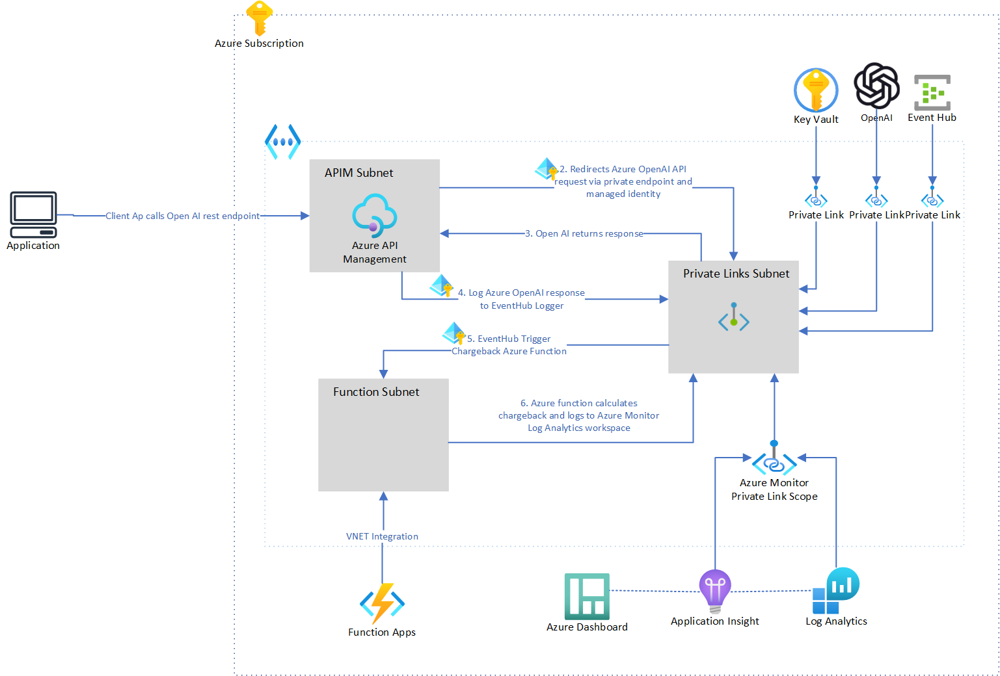

# Open AI with Azure API Management and Private Link for Chargeback

This sample demonstartes how to host an Azure OpenAI instance in a private and secure manner in their own Azure tenancy and publish the Azure OpenAI endpoints in Azure API Management. The solution uses Azure APIM `log-to-eventhub` policy to capture OpenAI requests and responses to calculate chargebacks.

The repo includes: 
1. Infrastructure as Code ( Bicep templates) to provision Azure resources for Azure OpenAI, Azure API Management, Azure Event Hub and Azure Function App and also configure the Private Links.

2. A function app that computes token usage across various consumers of the Azure OpenAI service. This implementation utilizes the Tokenizer package and computes token usage for both streaming and non-streaming requests to Azure OpenAI endpoints.

3. Test scripts to test OpenAI chat and chat completions endpoints in Azure API Management using powershell or shell scripts.

## Benefits

1. Private: Azure OpenAI Private Endpoints guarantees that data transmission remains protected from public internet exposure. By creating a private connection, Azure OpenAI Private Endpoints offer a secure and effective pathway for transmitting data between your infrastructure and the OpenAI service, thereby reducing potential security risks commonly associated with conventional public endpoints. Network traffic can be fully isolated to your network and other enterprise grade authentication security features are built in.

2. Centralised and Secure Access: By integrating Azure OpenAI with Azure API Management (APIM) through Private Endpoints, you can secure access to Azure OpenAI and oversee access control. Furthermore, you have the ability to monitor service usage and health. Additionally, access to the Azure OpenAI service is also regulated via API Keys to authenticate and capture OpenAI usage.

3.  Out of the box Token Usage Solution: The solution offers sample code for Azure functions that compute token usage across various consumers of the Azure OpenAI service. This implementation utilizes the Tokenizer package and computes token usage for both streaming and non-streaming requests to Azure OpenAI endpoints.

4. Policy as Code: Using Azure APIM policies to configure access control, throttling loging and usage limits. It uses APIM log-to-eventhub policy to capture OpenAI requests and responses and sends it to the chargeback solution for calculation  

5. End-to-end observability for applications: Azure Monitor provides access to application logs via Kusto Query Language. Also enables dashboard reports and monitoring and alerting capabilities.

## Application architecture



## Getting Started

### Account Requirements

In order to deploy and run this example, you'll need

* **Azure account**. If you're new to Azure, [get an Azure account for free](https://azure.microsoft.com/free/cognitive-search/) and you'll get some free Azure credits to get started.
* **Azure subscription with access enabled for the Azure OpenAI service**. You can request access with [this form](https://aka.ms/oaiapply). If your access request to Azure OpenAI service doesn't match the [acceptance criteria](https://learn.microsoft.com/legal/cognitive-services/openai/limited-access?context=%2Fazure%2Fcognitive-services%2Fopenai%2Fcontext%2Fcontext), you can use [OpenAI public API](https://platform.openai.com/docs/api-reference/introduction) instead. Learn [how to switch to an OpenAI instance](#switching-from-an-azure-openai-endpoint-to-an-openai-instance).
* **Azure account permissions**: Your Azure account must have `Microsoft.Authorization/roleAssignments/write` permissions, such as [Role Based Access Control Administrator](https://learn.microsoft.com/azure/role-based-access-control/built-in-roles#role-based-access-control-administrator-preview), [User Access Administrator](https://learn.microsoft.com/azure/role-based-access-control/built-in-roles#user-access-administrator), or [Owner](https://learn.microsoft.com/azure/role-based-access-control/built-in-roles#owner). If you don't have subscription-level permissions, you must be granted [RBAC](https://learn.microsoft.com/azure/role-based-access-control/built-in-roles#role-based-access-control-administrator-preview) for an existing resource group and [deploy to that existing group](#existing-resource-group).

### Deploy to Azure

Execute the following command, if you don't have any pre-existing Azure services and want to start from a fresh deployment.

1. Run `azd auth login`
2. If your account has multiple subscriptions, run `azd env set AZURE_SUBSCRIPTION_ID {Subscription ID}` to set the subscription you want to deploy to.
3. If you would like to give a custom name to the resource group, run `azd env set AZURE_RESOURCE_GROUP {Name of resource group}`. If you don't set this, resource group will be named `rg-enterprise-openai-${environmentName}`.
3. Run `azd up` - This will provision Azure resources and deploy this sample to those resource
4. After the application has been successfully deployed you will see a URL printed to the console.  Click that URL to interact with the application in your browser.
It will look like the following:


> NOTE: If you are running ```azd up``` for the first time, it may take upto 45 minutes for the application to be fully deployed as it it needs to wait for the Azure API Management to be fully provisioned. Subsequent deployments are a lot faster. You can check the status of the deployment by running `azd status`.


### Deploy to Azure with existing resources

If you already have existing Azure resources, you can re-use those by setting `azd` environment values.

#### Existing resource group

1. [OPTIONAL]: RUN `azd env set AZURE_SUBSCRIPTION_ID {Subscription ID}` if your account has multiple subscriptions and you want to deploy to a specific subscription.
1. Run `azd env set AZURE_RESOURCE_GROUP {Name of existing resource group}`
2. Run `azd env set AZURE_LOCATION {Location of existing resource group}`

### Deploying again

If you've only changed the function app code in the `app` folder, then you don't need to re-provision the Azure resources. You can just run:

```azd deploy```

If you've changed the infrastructure files (`infra` folder or `azure.yaml`), then you'll need to re-provision the Azure resources. You can do that by running:

```azd up```

### Clean up

To clean up all the resources created by this sample:

1. Run `azd down`
2. When asked if you are sure you want to continue, enter `y`
3. When asked if you want to permanently delete the resources, enter `y`

The resource group and all the resources will be deleted.

## Testing the solution

- Update the variables in the test script files with API Management service name `apimServiceName` and subscription key `apimSubscriptionKey`.
- To test OpenAI endpoints with stream enabled, update the value of `stream` variable to `true` in the test script files.

### Completion

1. Shell
    ```./test-scripts/testcompletions.sh ```

    <br>
2. Powershell
    ```./test-scripts/testcompletions.ps1```

### Chat Completion

1. Shell
    ```./test-scripts/testchatcompletions.sh``` 
    <br>
2. Powershell
    ```./test-scripts/testchatcompletions.ps1```


## Azure Monitor to calculate tokens usage for chargeback

- Once the Chargeback functionapp calculates the prompt and completion tokens per OpenAI request, it logs the information to Azure Log Analytics. 
- All custom logs from function app is logged to a table called `customEvents`

- Example query to identify token usage by a specific client key:
```kusto
customEvents
| where name contains "Azure OpenAI Tokens"
| extend tokenData = parse_json(customDimensions)
| where tokenData.AppKey contains "your-client-key"
| project    
    Timestamp = tokenData.Timestamp,
    Stream = tokenData.Stream,
    ApiOperation = tokenData.ApiOperation,    
    PromptTokens = tokenData.PromptTokens,
    CompletionTokens = tokenData.CompletionTokens,
    TotalTokens = tokenData.TotalTokens
```

- Example query to identify token usage for all consumers
```kusto
customEvents
| where name contains "Azure OpenAI Tokens"
| extend tokenData = parse_json(customDimensions)
| extend
    AppKey = tokenData.AppKey,
    PromptTokens = tokenData.PromptTokens,
    CompletionTokens = tokenData.CompletionTokens,
    TotalTokens = tokenData.TotalTokens
| summarize PromptTokens = sum(toint(PromptTokens)) , CompletionTokens = sum(toint(CompletionTokens)), TotalTokens = sum(toint(TotalTokens)) by tostring(AppKey)
| project strcat(substring(tostring(AppKey),0,8), "XXXX"), PromptTokens, CompletionTokens, TotalTokens
```

The queries can be exported to Azure Dashboards


## Additional Details

### Azure OpenAI Swagger Specification

[Azure OpenAI Swagger Spec](https://github.com/Azure/azure-rest-api-specs/blob/main/specification/cognitiveservices/data-plane/AzureOpenAI/inference/stable/2023-05-15/inference.json) is imported in Azure API Management.

### Tiktoken

[Tiktoken](https://www.nuget.org/packages/Tiktoken/1.1.2#show-readme-container) library is used to calculate tokens when "stream" is set as "true" to stream back partial progress from GPT models. 
*If stream is set, partial message deltas will be sent, Tokens will be sent as data-only server-sent events as they become available, with the stream terminated by a data: [DONE] message.*


